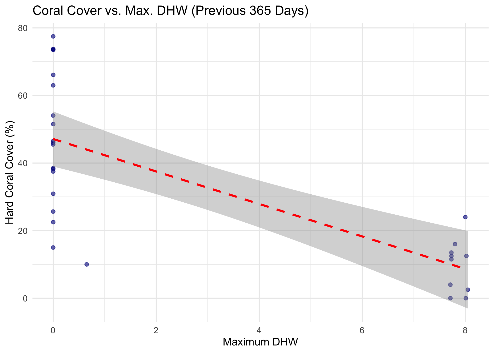

Getting environmental covariates for GFCR locations
================

# Load packages

``` r
# remotes::install_github("data-mermaid/mermaidr")
# remotes::install_github("data-mermaid/mermaidr-covariates")

library(mermaidr)
library(mermaidrcovariates)
library(tidyverse)
```

# Get project data from MERMAID

Aggregated data for GFCR projects

``` r
summary_sampleevents <- mermaid_get_summary_sampleevents()

gfcr_summary_sampleevents <- summary_sampleevents %>%
  filter(str_detect(tags, "GFCR"))
```

## Summary of hard coral cover for projects

``` r
gfcr_summary_sampleevents <- gfcr_summary_sampleevents %>%
  filter(!is.na(`benthicpit_percent_cover_benthic_category_avg_Hard coral`)) %>%
  rename(hard_coral_cover = `benthicpit_percent_cover_benthic_category_avg_Hard coral`)

gfcr_summary_sampleevents %>%
  group_by(project, tags, country) %>%
  summarise(
    n_sites = length(site),
    average_hard_coral_cover = mean(hard_coral_cover), .groups = "drop"
  )
```

<div class="kable-table">

| project | tags | country | n_sites | average_hard_coral_cover |
|:---|:---|:---|---:|---:|
| SLCRI Bar Reef Seascape | International Union for the Conservation of Nature (IUCN) Sri Lanka, Global Fund for Coral Reefs (GFCR) | Sri Lanka | 11 | 9.681818 |
| SLCRI Kayankerni Seascape | Global Fund for Coral Reefs (GFCR), International Union for the Conservation of Nature (IUCN) Sri Lanka | Sri Lanka | 11 | 44.390000 |
| SLCRI Pigeon Island Seascape | Global Fund for Coral Reefs (GFCR), International Union for the Conservation of Nature (IUCN) Sri Lanka | Sri Lanka | 7 | 55.865714 |

</div>

# Get covariates for these sites

## List STAC collections

``` r
list_collections()
```

    ## $`noaa-monthly-max-dhw`
    ## ###Collection
    ## - id: noaa-monthly-max-dhw
    ## - title: NOAA Degree Heating Week (DHW) - Monthly Aggregation
    ## - description: 
    ## The NOAA Coral Reef Watch (CRW) daily global 5km satellite coral bleaching Degree Heating Week (DHW) product shows accumulated heat stress, which can lead to coral bleaching and death. The scale ranges from 0 to 20 °C-weeks. The DHW product accumulates the instantaneous bleaching heat stress, measured by CRW's Coral Bleaching HotSpot, during the most recent 12-week period. It is directly related to the timing and intensity of coral bleaching.
    ## - field(s): 
    ## type, id, stac_version, description, links, stac_extensions, title, extent, license, keywords, providers, summaries

## Get maximum DHW for previous year

``` r
max_dhw <- gfcr_summary_sampleevents %>%
  summary_zonal_stats("noaa-monthly-max-dhw", n_days = 365, buffer = 100, stats = "max")
```

``` r
max_dhw <- max_dhw %>%
  select(project, country, site, sample_date, hard_coral_cover, covariates)

max_dhw
```

<div class="kable-table">

| project | country | site | sample_date | hard_coral_cover | covariates |
|:---|:---|:---|:---|---:|:---|
| SLCRI Bar Reef Seascape | Sri Lanka | Bar Reef Deep | 2025-03-16 | 12.50 | 19814 , 20148 , band_1 , 8.02000045776367 |
| SLCRI Bar Reef Seascape | Sri Lanka | Bar Reef Shallow | 2025-03-16 | 0.00 | 19814 , 20148 , band_1 , 8.01000022888184 |
| SLCRI Bar Reef Seascape | Sri Lanka | Hipolis Reef Deep | 2025-03-20 | 2.50 | 19814 , 20148 , band_1 , 8.05000019073486 |
| SLCRI Bar Reef Seascape | Sri Lanka | KandaKuliya Reef Deep | 2025-03-19 | 24.00 | 19814 , 20148 , band_1, 8 |
| SLCRI Bar Reef Seascape | Sri Lanka | Kudawa reef Deep | 2025-03-17 | 4.00 | 19814 , 20148 , band_1 , 7.71000003814697 |
| SLCRI Bar Reef Seascape | Sri Lanka | Kudawa Reef Shallow | 2025-03-17 | 0.00 | 19814 , 20148 , band_1 , 7.71000003814697 |
| SLCRI Bar Reef Seascape | Sri Lanka | Sea Guard Reef Deep | 2024-03-19 | 10.00 | 19448 , 19783 , band_1 , 0.649999976158142 |
| SLCRI Bar Reef Seascape | Sri Lanka | Sea Guard Reef Deep | 2025-03-19 | 16.00 | 19814 , 20148 , band_1 , 7.80000019073486 |
| SLCRI Bar Reef Seascape | Sri Lanka | St. Annes Reef Deep | 2025-03-20 | 13.50 | 19814 , 20148 , band_1 , 7.73000001907349 |
| SLCRI Bar Reef Seascape | Sri Lanka | Thalawila Reef Deep | 2025-03-15 | 11.50 | 19814 , 20148 , band_1 , 7.73000001907349 |
| SLCRI Bar Reef Seascape | Sri Lanka | Thalawila Reef Shallow | 2025-03-15 | 12.50 | 19814 , 20148 , band_1 , 7.73000001907349 |
| SLCRI Kayankerni Seascape | Sri Lanka | Elephant point East | 2023-05-25 | 25.64 | 19144 , 19478 , band_1, 0 |
| SLCRI Kayankerni Seascape | Sri Lanka | Elephant point West | 2023-05-25 | 15.00 | 19144 , 19478 , band_1, 0 |
| SLCRI Kayankerni Seascape | Sri Lanka | Kalkudah | 2023-05-29 | 46.00 | 19144 , 19478 , band_1, 0 |
| SLCRI Kayankerni Seascape | Sri Lanka | Pasikudah nearshore | 2023-05-28 | 45.50 | 19144 , 19478 , band_1, 0 |
| SLCRI Kayankerni Seascape | Sri Lanka | Pasikudah offshore | 2023-05-28 | 22.51 | 19144 , 19478 , band_1, 0 |
| SLCRI Kayankerni Seascape | Sri Lanka | Sand Island Leeward | 2023-05-24 | 38.50 | 19144 , 19478 , band_1, 0 |
| SLCRI Kayankerni Seascape | Sri Lanka | Sand Island Leeward | 2023-07-11 | 73.77 | 19205 , 19539 , band_1, 0 |
| SLCRI Kayankerni Seascape | Sri Lanka | Sand Island North East | 2023-07-11 | 66.09 | 19205 , 19539 , band_1, 0 |
| SLCRI Kayankerni Seascape | Sri Lanka | Sand Island North East | 2023-05-25 | 63.00 | 19144 , 19478 , band_1, 0 |
| SLCRI Kayankerni Seascape | Sri Lanka | Sand Island South East | 2023-05-24 | 38.22 | 19144 , 19478 , band_1, 0 |
| SLCRI Kayankerni Seascape | Sri Lanka | Sand Island South East | 2023-07-11 | 54.06 | 19205 , 19539 , band_1, 0 |
| SLCRI Pigeon Island Seascape | Sri Lanka | Coral island | 2023-06-19 | 77.50 | 19174 , 19509 , band_1, 0 |
| SLCRI Pigeon Island Seascape | Sri Lanka | Knife rock | 2023-06-17 | 30.91 | 19174 , 19509 , band_1, 0 |
| SLCRI Pigeon Island Seascape | Sri Lanka | Pigeon island Landward - 01 | 2023-06-16 | 73.61 | 19174 , 19509 , band_1, 0 |
| SLCRI Pigeon Island Seascape | Sri Lanka | Pigeon island Landward - 02 | 2023-06-16 | 51.52 | 19174 , 19509 , band_1, 0 |
| SLCRI Pigeon Island Seascape | Sri Lanka | Pigeon island Seaward | 2023-06-16 | 46.52 | 19174 , 19509 , band_1, 0 |
| SLCRI Pigeon Island Seascape | Sri Lanka | Pirate cove North to Headland | 2023-06-14 | 73.50 | 19174 , 19509 , band_1, 0 |
| SLCRI Pigeon Island Seascape | Sri Lanka | Uppuveli rocks | 2023-06-17 | 37.50 | 19174 , 19509 , band_1, 0 |

</div>

## Expand covariates

``` r
max_dhw <- max_dhw %>%
  unnest(covariates)

max_dhw
```

<div class="kable-table">

| project | country | site | sample_date | hard_coral_cover | covariates_start_date | covariates_end_date | band | max |
|:---|:---|:---|:---|---:|:---|:---|:---|---:|
| SLCRI Bar Reef Seascape | Sri Lanka | Bar Reef Deep | 2025-03-16 | 12.50 | 2024-04-01 | 2025-03-01 | band_1 | 8.020001 |
| SLCRI Bar Reef Seascape | Sri Lanka | Bar Reef Shallow | 2025-03-16 | 0.00 | 2024-04-01 | 2025-03-01 | band_1 | 8.010000 |
| SLCRI Bar Reef Seascape | Sri Lanka | Hipolis Reef Deep | 2025-03-20 | 2.50 | 2024-04-01 | 2025-03-01 | band_1 | 8.050000 |
| SLCRI Bar Reef Seascape | Sri Lanka | KandaKuliya Reef Deep | 2025-03-19 | 24.00 | 2024-04-01 | 2025-03-01 | band_1 | 8.000000 |
| SLCRI Bar Reef Seascape | Sri Lanka | Kudawa reef Deep | 2025-03-17 | 4.00 | 2024-04-01 | 2025-03-01 | band_1 | 7.710000 |
| SLCRI Bar Reef Seascape | Sri Lanka | Kudawa Reef Shallow | 2025-03-17 | 0.00 | 2024-04-01 | 2025-03-01 | band_1 | 7.710000 |
| SLCRI Bar Reef Seascape | Sri Lanka | Sea Guard Reef Deep | 2024-03-19 | 10.00 | 2023-04-01 | 2024-03-01 | band_1 | 0.650000 |
| SLCRI Bar Reef Seascape | Sri Lanka | Sea Guard Reef Deep | 2025-03-19 | 16.00 | 2024-04-01 | 2025-03-01 | band_1 | 7.800000 |
| SLCRI Bar Reef Seascape | Sri Lanka | St. Annes Reef Deep | 2025-03-20 | 13.50 | 2024-04-01 | 2025-03-01 | band_1 | 7.730000 |
| SLCRI Bar Reef Seascape | Sri Lanka | Thalawila Reef Deep | 2025-03-15 | 11.50 | 2024-04-01 | 2025-03-01 | band_1 | 7.730000 |
| SLCRI Bar Reef Seascape | Sri Lanka | Thalawila Reef Shallow | 2025-03-15 | 12.50 | 2024-04-01 | 2025-03-01 | band_1 | 7.730000 |
| SLCRI Kayankerni Seascape | Sri Lanka | Elephant point East | 2023-05-25 | 25.64 | 2022-06-01 | 2023-05-01 | band_1 | 0.000000 |
| SLCRI Kayankerni Seascape | Sri Lanka | Elephant point West | 2023-05-25 | 15.00 | 2022-06-01 | 2023-05-01 | band_1 | 0.000000 |
| SLCRI Kayankerni Seascape | Sri Lanka | Kalkudah | 2023-05-29 | 46.00 | 2022-06-01 | 2023-05-01 | band_1 | 0.000000 |
| SLCRI Kayankerni Seascape | Sri Lanka | Pasikudah nearshore | 2023-05-28 | 45.50 | 2022-06-01 | 2023-05-01 | band_1 | 0.000000 |
| SLCRI Kayankerni Seascape | Sri Lanka | Pasikudah offshore | 2023-05-28 | 22.51 | 2022-06-01 | 2023-05-01 | band_1 | 0.000000 |
| SLCRI Kayankerni Seascape | Sri Lanka | Sand Island Leeward | 2023-05-24 | 38.50 | 2022-06-01 | 2023-05-01 | band_1 | 0.000000 |
| SLCRI Kayankerni Seascape | Sri Lanka | Sand Island Leeward | 2023-07-11 | 73.77 | 2022-08-01 | 2023-07-01 | band_1 | 0.000000 |
| SLCRI Kayankerni Seascape | Sri Lanka | Sand Island North East | 2023-07-11 | 66.09 | 2022-08-01 | 2023-07-01 | band_1 | 0.000000 |
| SLCRI Kayankerni Seascape | Sri Lanka | Sand Island North East | 2023-05-25 | 63.00 | 2022-06-01 | 2023-05-01 | band_1 | 0.000000 |
| SLCRI Kayankerni Seascape | Sri Lanka | Sand Island South East | 2023-05-24 | 38.22 | 2022-06-01 | 2023-05-01 | band_1 | 0.000000 |
| SLCRI Kayankerni Seascape | Sri Lanka | Sand Island South East | 2023-07-11 | 54.06 | 2022-08-01 | 2023-07-01 | band_1 | 0.000000 |
| SLCRI Pigeon Island Seascape | Sri Lanka | Coral island | 2023-06-19 | 77.50 | 2022-07-01 | 2023-06-01 | band_1 | 0.000000 |
| SLCRI Pigeon Island Seascape | Sri Lanka | Knife rock | 2023-06-17 | 30.91 | 2022-07-01 | 2023-06-01 | band_1 | 0.000000 |
| SLCRI Pigeon Island Seascape | Sri Lanka | Pigeon island Landward - 01 | 2023-06-16 | 73.61 | 2022-07-01 | 2023-06-01 | band_1 | 0.000000 |
| SLCRI Pigeon Island Seascape | Sri Lanka | Pigeon island Landward - 02 | 2023-06-16 | 51.52 | 2022-07-01 | 2023-06-01 | band_1 | 0.000000 |
| SLCRI Pigeon Island Seascape | Sri Lanka | Pigeon island Seaward | 2023-06-16 | 46.52 | 2022-07-01 | 2023-06-01 | band_1 | 0.000000 |
| SLCRI Pigeon Island Seascape | Sri Lanka | Pirate cove North to Headland | 2023-06-14 | 73.50 | 2022-07-01 | 2023-06-01 | band_1 | 0.000000 |
| SLCRI Pigeon Island Seascape | Sri Lanka | Uppuveli rocks | 2023-06-17 | 37.50 | 2022-07-01 | 2023-06-01 | band_1 | 0.000000 |

</div>

# Visualize

``` r
ggplot(
  max_dhw,
  aes(
    x = max,
    y = hard_coral_cover
  )
) +
  geom_point(color = "darkblue", alpha = 0.6) +
  geom_smooth(method = "lm", color = "red", linetype = "dashed") +
  labs(
    title = paste("Coral Cover vs. Max. DHW (Previous 365 Days)"),
    x = "Maximum DHW",
    y = "Hard Coral Cover (%)"
  ) +
  theme_minimal()
```

<!-- -->
