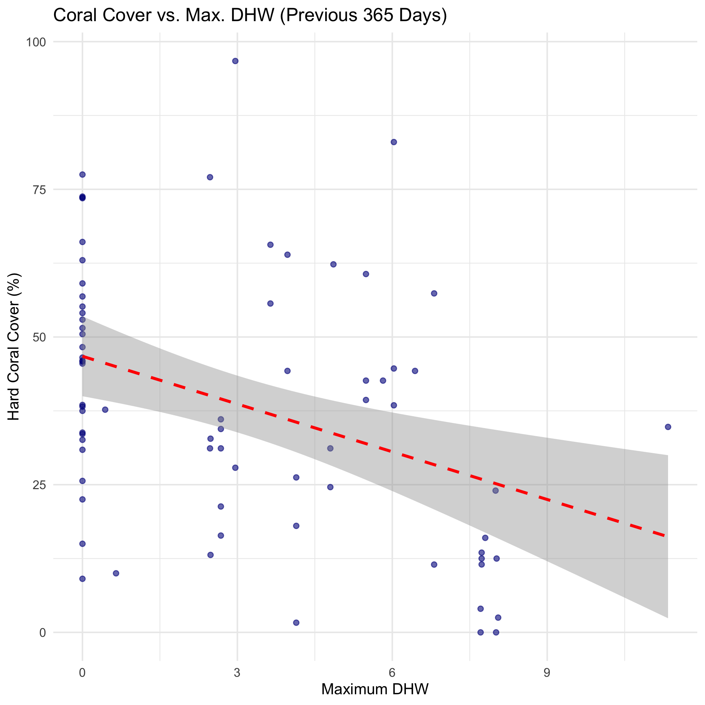

This analysis extracts covariates for GFCR project sites from MERMAID, then combines that with coral cover data to plot the relationship between the two. In this example, the environmental data is maximum degree heating weeks (DHW) for a given number of days prior to the survey.


# Load packages

Load libraries to use for analysis.


``` r
# Need to run this to ensure that rstac works, because the API is missing "type" in Items:
# remotes::install_github("sharlagelfand/rstac", ref = "invalid-item")

# remotes::install_github("data-mermaid/mermaidr")
# remotes::install_github("data-mermaid/mermaidr-covariates")

library(mermaidr)
library(mermaidrcovariates)
library(tidyverse)
```

# Get project data from MERMAID

The first step is to get coral cover data for GFCR projects from MERMAID. The following gets summary sample events, and then filters for projects whose tags contain "GFCR", and projects that have hard coral cover data.


``` r
summary_sampleevents <- mermaid_get_summary_sampleevents()

gfcr_summary_sampleevents <- summary_sampleevents %>%
  filter(str_detect(tags, "GFCR")) %>%
  filter(!is.na(`benthicpit_percent_cover_benthic_category_avg_Hard coral`)) %>%
  rename(hard_coral_cover = `benthicpit_percent_cover_benthic_category_avg_Hard coral`)

gfcr_summary_sampleevents
```

```
## # A tibble: 73 × 380
##    project_id      project tags  country site_id site  latitude longitude reef_type
##    <chr>           <chr>   <chr> <chr>   <chr>   <chr>    <dbl>     <dbl> <chr>    
##  1 8a747031-4ebd-… Invest… Unit… Fiji    2ecee0… GA1      -16.5      179. barrier  
##  2 8a747031-4ebd-… Invest… Unit… Fiji    4f1394… GA2      -16.5      179. barrier  
##  3 8a747031-4ebd-… Invest… Unit… Fiji    f3ae80… GA3      -16.5      179. barrier  
##  4 8a747031-4ebd-… Invest… Unit… Fiji    35cbcc… GA4      -16.6      179. barrier  
##  5 8a747031-4ebd-… Invest… Unit… Fiji    53220e… GA5      -16.6      179. barrier  
##  6 8a747031-4ebd-… Invest… Unit… Fiji    2f53e7… GA6      -16.6      179. fringing 
##  7 8a747031-4ebd-… Invest… Unit… Fiji    4e28c5… QR1      -16.1      180. barrier  
##  8 8a747031-4ebd-… Invest… Unit… Fiji    14b477… QR2      -16.1      180. barrier  
##  9 8a747031-4ebd-… Invest… Unit… Fiji    687440… QR3      -16.2      180. barrier  
## 10 8a747031-4ebd-… Invest… Unit… Fiji    fd9428… QR4      -16.2      180. barrier  
## # ℹ 63 more rows
## # ℹ 371 more variables: reef_zone <chr>, reef_exposure <chr>, management_id <chr>,
## #   management <chr>, management_est_year <int>, management_size <dbl>,
## #   management_parties <chr>, management_compliance <chr>, management_rules <chr>,
## #   sample_date <date>, data_policy_beltfish <chr>, data_policy_benthiclit <chr>,
## #   data_policy_benthicpit <chr>, data_policy_benthicpqt <chr>,
## #   data_policy_habitatcomplexity <chr>, data_policy_bleachingqc <chr>, …
```

## Summary of hard coral cover for projects

Summarise projects to show their tags, country, number of sites, and average hard coral cover.


``` r
gfcr_summary_sampleevents %>%
  group_by(project, tags, country) %>%
  summarise(
    n_sites = length(site),
    average_hard_coral_cover = mean(hard_coral_cover), .groups = "drop"
  )
```

```
## # A tibble: 6 × 5
##   project                              tags  country n_sites average_hard_coral_c…¹
##   <chr>                                <chr> <chr>     <int>                  <dbl>
## 1 Investing in Coral Reefs and the Bl… Unit… Fiji         27                  38.0 
## 2 Maldives RREEF (GFCR)                Glob… Maldiv…      11                  43.4 
## 3 SLCRI Bar Reef Seascape              Inte… Sri La…      11                   9.68
## 4 SLCRI Kayankerni Seascape            Glob… Sri La…      11                  44.4 
## 5 SLCRI Pigeon Island Seascape         Glob… Sri La…       7                  55.9 
## 6 Terumbu Karang Sehat Indonesia Prog… Cons… Indone…       6                  53.7 
## # ℹ abbreviated name: ¹​average_hard_coral_cover
```

# Get covariates for these sites

Next, get the relevant covariates for these sites.

## List STAC collections

List available STAC collections. We have available the monthly aggregation of Degree Heating Weeks (DHW).


``` r
list_collections()
```

```
## $`noaa-monthly-max-dhw`
## ###Collection
## - id: noaa-monthly-max-dhw
## - title: NOAA Degree Heating Week (DHW) - Monthly Aggregation
## - description: 
## The NOAA Coral Reef Watch (CRW) daily global 5km satellite coral bleaching Degree Heating Week (DHW) product shows accumulated heat stress, which can lead to coral bleaching and death. The scale ranges from 0 to 20 °C-weeks. The DHW product accumulates the instantaneous bleaching heat stress, measured by CRW's Coral Bleaching HotSpot, during the most recent 12-week period. It is directly related to the timing and intensity of coral bleaching.
## - field(s): 
## type, id, stac_version, description, links, stac_extensions, title, extent, license, keywords, providers, summaries
```

## Get maximum DHW for previous year

Focus on degree heating weeks (DHW), and get the max (of the monhtly average) for the 365 days prior to the survey data. Review the survey data:


``` r
gfcr_summary_sampleevents %>%
  distinct(project, site, latitude, longitude, sample_date)
```

```
## # A tibble: 73 × 5
##    project                                     site  latitude longitude sample_date
##    <chr>                                       <chr>    <dbl>     <dbl> <date>     
##  1 Investing in Coral Reefs and the Blue Econ… GA1      -16.5      179. 2025-10-08 
##  2 Investing in Coral Reefs and the Blue Econ… GA2      -16.5      179. 2025-10-08 
##  3 Investing in Coral Reefs and the Blue Econ… GA3      -16.5      179. 2025-10-09 
##  4 Investing in Coral Reefs and the Blue Econ… GA4      -16.6      179. 2025-10-09 
##  5 Investing in Coral Reefs and the Blue Econ… GA5      -16.6      179. 2025-10-08 
##  6 Investing in Coral Reefs and the Blue Econ… GA6      -16.6      179. 2025-10-08 
##  7 Investing in Coral Reefs and the Blue Econ… QR1      -16.1      180. 2025-09-24 
##  8 Investing in Coral Reefs and the Blue Econ… QR2      -16.1      180. 2025-09-24 
##  9 Investing in Coral Reefs and the Blue Econ… QR3      -16.2      180. 2025-09-24 
## 10 Investing in Coral Reefs and the Blue Econ… QR4      -16.2      180. 2025-09-25 
## # ℹ 63 more rows
```

The `summary_zonal_stats()` function takes the site latitude and longitude, as well as the survey date, to find the data at that site for `n` days prior, then aggregates it. The buffer size is set to 1000 metres.


``` r
max_dhw <- gfcr_summary_sampleevents %>%
  summary_zonal_stats("noaa-monthly-max-dhw", n_days = 365, buffer = 1000, stats = "max")
```

Look at the returned data, keeping only the project information, site, survey date, hard coral cover, and covariates.


``` r
max_dhw <- max_dhw %>%
  select(project, country, site, sample_date, hard_coral_cover, covariates)

max_dhw
```

```
## # A tibble: 73 × 6
##    project                    country site  sample_date hard_coral_cover covariates
##    <chr>                      <chr>   <chr> <date>                 <dbl> <list>    
##  1 Investing in Coral Reefs … Fiji    GA1   2025-10-08              62.3 <tibble>  
##  2 Investing in Coral Reefs … Fiji    GA2   2025-10-08              31.2 <tibble>  
##  3 Investing in Coral Reefs … Fiji    GA3   2025-10-09              24.6 <tibble>  
##  4 Investing in Coral Reefs … Fiji    GA4   2025-10-09              42.6 <tibble>  
##  5 Investing in Coral Reefs … Fiji    GA5   2025-10-08              11.5 <tibble>  
##  6 Investing in Coral Reefs … Fiji    GA6   2025-10-08              57.4 <tibble>  
##  7 Investing in Coral Reefs … Fiji    QR1   2025-09-24              27.9 <tibble>  
##  8 Investing in Coral Reefs … Fiji    QR2   2025-09-24              96.7 <tibble>  
##  9 Investing in Coral Reefs … Fiji    QR3   2025-09-24              77.0 <tibble>  
## 10 Investing in Coral Reefs … Fiji    QR4   2025-09-25              13.1 <tibble>  
## # ℹ 63 more rows
```

## Expand covariates

The covariates are currently in a format that need to be expanded. Once they are, you can see they contain start and end date of the data used for the covariates, the band, and the summarised value.


``` r
max_dhw %>%
  select(covariates) %>%
  unnest(covariates)
```

```
## # A tibble: 73 × 6
##    covariate            start_date end_date    band statistic value
##    <chr>                <date>     <date>     <dbl> <chr>     <dbl>
##  1 noaa-monthly-max-dhw 2024-11-01 2025-04-01     1 max        4.86
##  2 noaa-monthly-max-dhw 2024-11-01 2025-04-01     1 max        4.80
##  3 noaa-monthly-max-dhw 2024-11-01 2025-04-01     1 max        4.80
##  4 noaa-monthly-max-dhw 2024-11-01 2025-04-01     1 max        5.82
##  5 noaa-monthly-max-dhw 2024-11-01 2025-04-01     1 max        6.81
##  6 noaa-monthly-max-dhw 2024-11-01 2025-04-01     1 max        6.81
##  7 noaa-monthly-max-dhw 2024-10-01 2025-04-01     1 max        2.96
##  8 noaa-monthly-max-dhw 2024-10-01 2025-04-01     1 max        2.96
##  9 noaa-monthly-max-dhw 2024-10-01 2025-04-01     1 max        2.47
## 10 noaa-monthly-max-dhw 2024-10-01 2025-04-01     1 max        2.48
## # ℹ 63 more rows
```

``` r
max_dhw <- max_dhw %>%
  unnest(covariates)

max_dhw
```

```
## # A tibble: 73 × 11
##    project          country site  sample_date hard_coral_cover covariate start_date
##    <chr>            <chr>   <chr> <date>                 <dbl> <chr>     <date>    
##  1 Investing in Co… Fiji    GA1   2025-10-08              62.3 noaa-mon… 2024-11-01
##  2 Investing in Co… Fiji    GA2   2025-10-08              31.2 noaa-mon… 2024-11-01
##  3 Investing in Co… Fiji    GA3   2025-10-09              24.6 noaa-mon… 2024-11-01
##  4 Investing in Co… Fiji    GA4   2025-10-09              42.6 noaa-mon… 2024-11-01
##  5 Investing in Co… Fiji    GA5   2025-10-08              11.5 noaa-mon… 2024-11-01
##  6 Investing in Co… Fiji    GA6   2025-10-08              57.4 noaa-mon… 2024-11-01
##  7 Investing in Co… Fiji    QR1   2025-09-24              27.9 noaa-mon… 2024-10-01
##  8 Investing in Co… Fiji    QR2   2025-09-24              96.7 noaa-mon… 2024-10-01
##  9 Investing in Co… Fiji    QR3   2025-09-24              77.0 noaa-mon… 2024-10-01
## 10 Investing in Co… Fiji    QR4   2025-09-25              13.1 noaa-mon… 2024-10-01
## # ℹ 63 more rows
## # ℹ 4 more variables: end_date <date>, band <dbl>, statistic <chr>, value <dbl>
```

# Visualize

Finally, visualize coral cover against the maximum mean DHW for the past 365 days.


``` r
ggplot(
  max_dhw,
  aes(
    x = value,
    y = hard_coral_cover
  )
) +
  geom_point(color = "darkblue", alpha = 0.6) +
  geom_smooth(method = "lm", color = "red", linetype = "dashed") +
  labs(
    title = paste("Coral Cover vs. Max. DHW (Previous 365 Days)"),
    x = "Maximum DHW",
    y = "Hard Coral Cover (%)"
  ) +
  theme_minimal()
```


