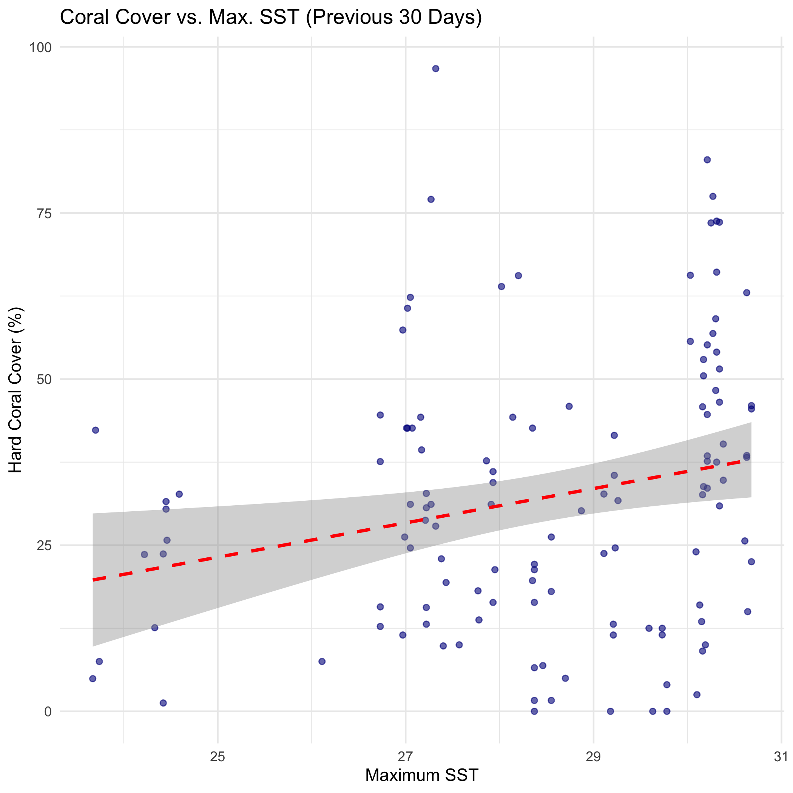

This analysis extracts covariates for GFCR project sites from MERMAID, then combines that with coral cover data to plot the relationship between the two. In this example, the environmental data is maximum daily Sea Surface Temperature (SST) for a given number of days prior to the survey.


# Load packages

Load libraries to use for analysis.


``` r
# remotes::install_github("data-mermaid/mermaidr")
# remotes::install_github("data-mermaid/mermaidr-covariates")

library(mermaidr)
library(mermaidrcovariates)
library(tidyverse)
```

# Get project data from MERMAID

The first step is to get coral cover data for GFCR projects from MERMAID. The following gets summary sample events, and then filters for projects whose tags contain "GFCR", and projects that have hard coral cover data.


``` r
summary_sampleevents <- mermaid_get_summary_sampleevents()

gfcr_summary_sampleevents <- summary_sampleevents %>%
  filter(str_detect(tags, "GFCR")) %>%
  filter(!is.na(`benthicpit_percent_cover_benthic_category_avg_Hard coral`)) %>%
  rename(hard_coral_cover = `benthicpit_percent_cover_benthic_category_avg_Hard coral`)

gfcr_summary_sampleevents
```

```
## # A tibble: 130 × 382
##    project_id     project tags  country site_id site  latitude longitude reef_type
##    <chr>          <chr>   <chr> <chr>   <chr>   <chr>    <dbl>     <dbl> <chr>    
##  1 1370aaba-fe43… Gulf o… Glob… Jordan  399b38… Aqab…     29.4      35.0 fringing 
##  2 1370aaba-fe43… Gulf o… Glob… Jordan  399b38… Aqab…     29.4      35.0 fringing 
##  3 1370aaba-fe43… Gulf o… Glob… Jordan  399b38… Aqab…     29.4      35.0 fringing 
##  4 1370aaba-fe43… Gulf o… Glob… Jordan  399b38… Aqab…     29.4      35.0 fringing 
##  5 1370aaba-fe43… Gulf o… Glob… Jordan  399b38… Aqab…     29.4      35.0 fringing 
##  6 1370aaba-fe43… Gulf o… Glob… Jordan  399b38… Aqab…     29.4      35.0 fringing 
##  7 1370aaba-fe43… Gulf o… Glob… Jordan  399b38… Aqab…     29.4      35.0 fringing 
##  8 1370aaba-fe43… Gulf o… Glob… Jordan  399b38… Aqab…     29.4      35.0 fringing 
##  9 1370aaba-fe43… Gulf o… Glob… Jordan  399b38… Aqab…     29.4      35.0 fringing 
## 10 1370aaba-fe43… Gulf o… Glob… Jordan  04e931… Nort…     29.5      35.0 fringing 
## # ℹ 120 more rows
## # ℹ 373 more variables: reef_zone <chr>, reef_exposure <chr>,
## #   management_id <chr>, management <chr>, management_est_year <int>,
## #   management_size <dbl>, management_parties <chr>, management_compliance <chr>,
## #   management_rules <chr>, sample_date <date>, data_policy_beltfish <chr>,
## #   data_policy_benthiclit <chr>, data_policy_benthicpit <chr>,
## #   data_policy_benthicpqt <chr>, data_policy_habitatcomplexity <chr>, …
```

## Summary of hard coral cover for projects

Summarise projects to show their tags, country, number of sites, and average hard coral cover.


``` r
gfcr_summary_sampleevents %>%
  group_by(project, tags, country) %>%
  summarise(
    n_sites = length(site),
    average_hard_coral_cover = mean(hard_coral_cover), .groups = "drop"
  )
```

```
## # A tibble: 7 × 5
##   project                             tags  country n_sites average_hard_coral_c…¹
##   <chr>                               <chr> <chr>     <int>                  <dbl>
## 1 Gulf of Aqaba Resilient Reefs Prog… Glob… Jordan       29                  21.4 
## 2 Investing in Coral Reefs and the B… Unit… Fiji         53                  30.9 
## 3 Maldives RREEF (GFCR)               Glob… Maldiv…      11                  43.4 
## 4 SLCRI Bar Reef Seascape             Inte… Sri La…      11                   9.68
## 5 SLCRI Kayankerni Seascape           Inte… Sri La…      11                  44.4 
## 6 SLCRI Pigeon Island Seascape        Inte… Sri La…       7                  55.9 
## 7 Terumbu Karang Sehat Indonesia Pro… Cons… Indone…       8                  50.0 
## # ℹ abbreviated name: ¹​average_hard_coral_cover
```

# Get covariates for these sites

Next, get the relevant covariates for these sites.

## List covariates

List available covariates.


``` r
list_covariates()
```

```
## # A tibble: 10 × 10
##    id           title description start_date end_date   license keywords providers
##    <chr>        <chr> <chr>       <date>     <date>     <chr>   <chr>    <list>   
##  1 10da4b11-c7… Huma… "This data… 2021-12-28 NA         propri… climate… <tibble> 
##  2 3e410700-2e… MEOW… "This data… 2012-01-01 2012-12-31 propri… <NA>     <tibble> 
##  3 50b810fb-5f… Dail… "Sea surfa… 1985-01-01 2026-01-13 CC0-1.0 climate… <tibble> 
##  4 640da5d3-53… ACA … "Allen Cor… 2018-01-01 2022-12-31 CC-BY-… allen c… <tibble> 
##  5 aca_extent   ACA … "ACA Reef … 2026-01-01 NA         CC0-1.0 aca, re… <tibble> 
##  6 countries    Coun… "Country B… 2026-01-01 NA         CC0-1.0 adminis… <tibble> 
##  7 daily_sst    Dail… "A collect… 1985-01-01 1985-01-03 CC0-1.0 climate… <tibble> 
##  8 disp_points  Disp… "Dispersal… 2026-01-01 NA         CC0-1.0 dispers… <tibble> 
##  9 lulc         Land… "Land Use … 2000-01-01 2020-01-01 CC0-1.0 land co… <tibble> 
## 10 sediment_ex… Glob… "Global Se… 2000-01-01 2000-01-01 propri… sedimen… <tibble> 
## # ℹ 2 more variables: `sci:citation` <chr>, bbox <list>
```

## Get maximum SST for previous year

Focus on Sea Surface Temperature, and get the max for the 60 days prior to the survey data. Review the survey data:


``` r
gfcr_summary_sampleevents %>%
  distinct(project, site, latitude, longitude, sample_date)
```

```
## # A tibble: 130 × 5
##    project                                 site     latitude longitude sample_date
##    <chr>                                   <chr>       <dbl>     <dbl> <date>     
##  1 Gulf of Aqaba Resilient Reefs Programme Aqaba M…     29.4      35.0 2024-12-08 
##  2 Gulf of Aqaba Resilient Reefs Programme Aqaba M…     29.4      35.0 2025-07-30 
##  3 Gulf of Aqaba Resilient Reefs Programme Aqaba M…     29.4      35.0 2024-12-01 
##  4 Gulf of Aqaba Resilient Reefs Programme Aqaba M…     29.4      35.0 2024-12-09 
##  5 Gulf of Aqaba Resilient Reefs Programme Aqaba M…     29.4      35.0 2025-10-28 
##  6 Gulf of Aqaba Resilient Reefs Programme Aqaba M…     29.4      35.0 2024-12-24 
##  7 Gulf of Aqaba Resilient Reefs Programme Aqaba M…     29.4      35.0 2024-12-06 
##  8 Gulf of Aqaba Resilient Reefs Programme Aqaba M…     29.4      35.0 2025-10-29 
##  9 Gulf of Aqaba Resilient Reefs Programme Aqaba M…     29.4      35.0 2025-09-01 
## 10 Gulf of Aqaba Resilient Reefs Programme Norther…     29.5      35.0 2025-10-26 
## # ℹ 120 more rows
```

We can access SST data by using the function `get_summary_zonal_statistics()`, which takes the site latitude and longitude, as well as the survey date, to find the data at that site for `n_days` days prior, within the given `radius`, and *spatially* aggregates it according to the specified `spatial_stat`. 

For example, to get the **maximum** SST over the 0 days prior to (and including) the sample event, using the *mean* SST within 100m of the sites:


``` r
max_sst <- gfcr_summary_sampleevents %>%
  get_summary_zonal_statistics("Daily Sea Surface Temperature", n_days = 60, radius = 100, spatial_stats = "mean", temporal_stats = "max")
```


Look at the returned data, keeping only the project information, site, survey date, hard coral cover, and covariates.


``` r
max_sst <- max_sst %>%
  select(site, sample_date, hard_coral_cover, covariates)

max_sst
```

```
## # A tibble: 130 × 4
##    site                 sample_date hard_coral_cover covariates      
##    <chr>                <date>                 <dbl> <list>          
##  1 Aqaba Marine Reserve 2024-12-08              31.6 <tibble [1 × 8]>
##  2 Aqaba Marine Reserve 2025-07-30              31.7 <tibble [1 × 8]>
##  3 Aqaba Marine Reserve 2024-12-01              32.7 <tibble [1 × 8]>
##  4 Aqaba Marine Reserve 2024-12-09              30.4 <tibble [1 × 8]>
##  5 Aqaba Marine Reserve 2025-10-28              37.6 <tibble [1 × 8]>
##  6 Aqaba Marine Reserve 2024-12-24              42.3 <tibble [1 × 8]>
##  7 Aqaba Marine Reserve 2024-12-06              25.8 <tibble [1 × 8]>
##  8 Aqaba Marine Reserve 2025-10-29              44.6 <tibble [1 × 8]>
##  9 Aqaba Marine Reserve 2025-09-01              30.2 <tibble [1 × 8]>
## 10 Northern Deep Corals 2025-10-26              15.7 <tibble [1 × 8]>
## # ℹ 120 more rows
```

## Expand covariates

The covariates are currently in a format that need to be expanded. Once they are, you can see they contain start and end date of the data used for the covariates, the band, and the summarised value.


``` r
max_sst <- max_sst %>%
  unnest(covariates)

max_sst
```

```
## # A tibble: 130 × 11
##    site                 sample_date hard_coral_cover covariate                    
##    <chr>                <date>                 <dbl> <chr>                        
##  1 Aqaba Marine Reserve 2024-12-08              31.6 Daily Sea Surface Temperature
##  2 Aqaba Marine Reserve 2025-07-30              31.7 Daily Sea Surface Temperature
##  3 Aqaba Marine Reserve 2024-12-01              32.7 Daily Sea Surface Temperature
##  4 Aqaba Marine Reserve 2024-12-09              30.4 Daily Sea Surface Temperature
##  5 Aqaba Marine Reserve 2025-10-28              37.6 Daily Sea Surface Temperature
##  6 Aqaba Marine Reserve 2024-12-24              42.3 Daily Sea Surface Temperature
##  7 Aqaba Marine Reserve 2024-12-06              25.8 Daily Sea Surface Temperature
##  8 Aqaba Marine Reserve 2025-10-29              44.6 Daily Sea Surface Temperature
##  9 Aqaba Marine Reserve 2025-09-01              30.2 Daily Sea Surface Temperature
## 10 Northern Deep Corals 2025-10-26              15.7 Daily Sea Surface Temperature
##    start_date end_date   n_dates  band temporal_stat spatial_stat value
##    <date>     <date>       <int> <dbl> <chr>         <chr>        <dbl>
##  1 2024-10-10 2024-12-08      60     1 max           mean          26.1
##  2 2025-06-01 2025-07-30      60     1 max           mean          29.3
##  3 2024-10-03 2024-12-01      60     1 max           mean          26.3
##  4 2024-10-11 2024-12-09      60     1 max           mean          26.1
##  5 2025-08-30 2025-10-28      60     1 max           mean          28.0
##  6 2024-10-26 2024-12-24      60     1 max           mean          24.7
##  7 2024-10-08 2024-12-06      60     1 max           mean          26.1
##  8 2025-08-31 2025-10-29      60     1 max           mean          28.0
##  9 2025-07-04 2025-09-01      60     1 max           mean          29.3
## 10 2025-08-28 2025-10-26      60     1 max           mean          28  
## # ℹ 120 more rows
```

# Visualize

Finally, visualize coral cover against the maximum Sea Surface Temperature for the past 60 days.


``` r
ggplot(
  max_sst,
  aes(
    x = value,
    y = hard_coral_cover
  )
) +
  geom_point(color = "darkblue", alpha = 0.6) +
  geom_smooth(method = "lm", color = "red", linetype = "dashed") +
  labs(
    title = paste("Coral Cover vs. Max. SST (Previous 60 Days)"),
    x = "Maximum SST",
    y = "Hard Coral Cover (%)"
  ) +
  theme_minimal()
```


